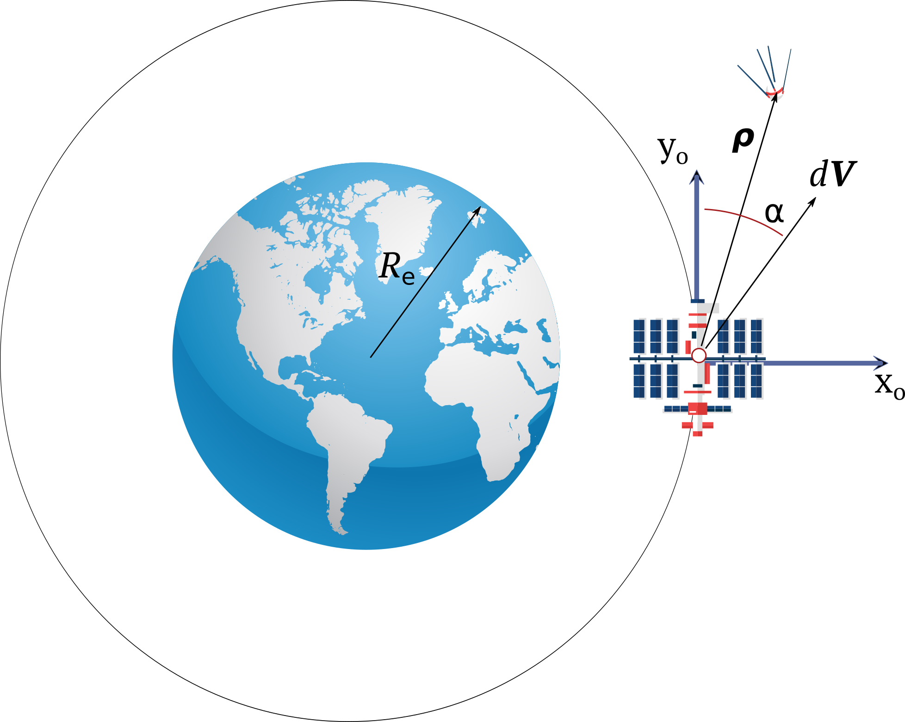

Разработать программу для построения траектории движения наноспутника, отделившегося от орбитальной станции. Траекторию движения наноспутника необходимо построить в орбитальной подвижной системе координат, связанной со станцией. Станция движется по круговой орбите высотой $$h$$. Ось $$x _o$$ орбитальной подвижной системы координат направлена от Земли вдоль радиус вектора станции. Ось $$y_o$$ лежит в плоскости орбиты и направлена в сторону орбитальной скорости станции. Ось $$z_o$$ дополняет систему координат до правой.   

Построить траектории движения наноспутника для скорости отделения 1 м/с при угле отделения $$\alpha=0$$, $$\alpha=90$$, $$\alpha=180$$,  $$\alpha=270$$ градусов на интервале трех орбитальных периодов обращения станции вокруг Земли.

  
## Методические указания

Движение наноспутника относительно станции в орбитальной подвижной системе координат, связанной со станцией, предполагая, что расстояние между станцией и наноспутником значительно меньше, чем расстояние от станции до центра Земли, описывается следующими уравнениями:

$$
	\boldsymbol x =   
	\begin{bmatrix}  
		4-3c & 0 & 0 & s/n & 2/n-2c/n & 0 \\
		-6nt+6s & 1 & 0 & -2/n + 2c/n & 4s/n - 3t & 0 \\
		0 & 0 & c & 0 & 0 & s/n \\
		3ns & 0 & 0 & c & 2s & 0 \\
		-6n +6nc & 0 & 0 & -2s & -3+4c & 0 \\
		0 & 0 & -ns & 0 & 0 & c 
	\end{bmatrix} \boldsymbol x(0)	 	
$$

где $$s = \sin nt, \, c = \cos nt$$, $$n$$ -- угловая скорость орбитального движения станции:

$$
	n = \sqrt{\frac{\mu}{r^3}}
$$

$$r$$ -- радиус круговой орбиты станции, $$\mu = 398600.448$$ км$$^3$$/c$$^2$$ -- гравитационный параметр Земли, $$\boldsymbol x$$ -- вектор состояния наноспутника:

$$
	\boldsymbol x = \begin{bmatrix} x \\ y \\ z \\ \dot x \\ \dot y \\ \dot z \end{bmatrix}, \quad 
$$

$$\boldsymbol x(0)$$ -- вектор начального состояния наноспутника:

$$	
	\boldsymbol x(0) = \begin{bmatrix} x(0) \\ y(0) \\ z(0) \\ \dot x(0) \\ \dot y(0) \\ \dot z(0) \end{bmatrix}
$$

Версия функции для аргумента t - скаляра: 

~~~matlab

function x = get_orbital_state(x0, n, t)    
%x = get_orbital_state(x0, n, t) 
% x0 - 6x1 [x0;y0;z0;vx0;vy0;vz0] - начальное положение и скорость м, м/с
% n  - 1x1 угловая скорость орбитального движения станции рад/с
% t  - 1x1 время 
    c   = cos(n*t);
    s   = sin(n*t);
   
    A  = [4-3*c 0 0 s/n 2/n-2*c/n 0;
          -6*n*t+6*s 1 0 -2/n+2*c/n  4*s/n-3*t 0;
          0 0 c 0 0 s/n;
          3*n*s 0 0 c 2*s 0; 
          -6*n+6*n*c 0 0 -2*s -3+4*c 0;
          0 0 -n*s 0 0 c];
    
    x  = A*reshape(x0,[],1);
    
end

~~~

