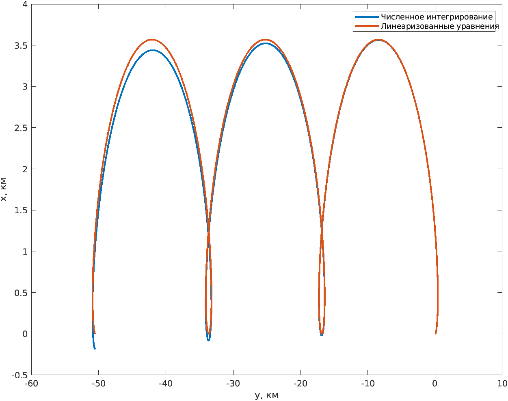

## Задание

1. Написать программу численного интегрирования уравнений движения материальной точки в центральном гравитационном поле Земли по отношению к геоцентрической инерциальной системе координат.

Пример функция правых частей

~~~matlab
function dq = dqdt(t,q,p)    
    r  = q(1:3);    
    v  = q(4:6);    
    mu = p.mu;
    a  = - mu*r/norm(r)^3;
    dq = [v; a];
end
~~~

~~~matlab
p.mu = ...
...

[t, q] = ode113(@(t,q,p) ... )
...
~~~

2. Получить численное решение движения орбитальной станции по круговой орбите высотой 450 км на интервале трех орбитальных периодов станции. Установить требуемую абсолютную погрешность  метода численного интегрирования не более: $$10^{-8}$$. 

3. Получить численные решения движения наноспутника, отделившегося от станции со скоростью 1 м/с в направлении орбитальной скорости станции (случай А), в направлении противоположном орбитальной скорости станции (случай В). Установить требуемую абсолютную погрешность  метода численного интегрирования не более: $$10^{-8}$$. 

4. Построить на одном рисунке две траектории (для случаев А и В) движения наноспутника относительно станции в орбитальной подвижной системе координат станции на интервале её трех орбитальных периодов.

5. Построить на одном рисунке две траектории движения наноспутника относительно станции в орбитальной подвижной системе координат станции, используя приближенные уравнения  относительного орбитального движения (результаты [ЛР №1](../lab_hill_frame)) на интервале трех орбитальных периодов станции.

6. Построить два рисунка, соответствующие двум разным направлениям отделения наноспутника, на каждом из которых показать траектории движения наноспутника, полученные в результате численного интегрирования и с использованием приближенных уравнений относительного движения. 

Пример рисунка для случая отделения наноспутника в направлении орбитальной скорости станции:

7. Для двух рассматриваемых случаев найти абсолютную погрешность определения положения наноспутника через три орбитальных периода станции, используя приближенные уравнения относительного орбитального движения, приняв за точное положение результаты численного интегрирования движения наноспутника (п. 3).   
 

 ## Методические указания

 В каждый момент времени единичные вектора орбитальной системы координат станции определяются следующим образом. Единичный вектор оси $$x_o$$ орбитальной системы координат, направленный вдоль радиус-вектора орбиты:

$$
    \mathbf{e}_r = \frac{\mathbf{r}_1}{|\mathbf{r}_1|}
$$

где $$\boldsymbol r_1$$ координатный столбец радиус-вектора станции в геоцентрической инерциальной системе координат. Единичный вектор нормали к плоскости орбиты:

$$
    \mathbf{e}_n = \frac{\mathbf{e}_r \times \mathbf{v}_1}{|\mathbf{e}_r \times \mathbf{v}_1|}
$$

единичный вектор трансверсали 

$$
    \mathbf{e}_t = \mathbf{e}_n \times \mathbf{e}_r
$$

Координаты наноспутника в орбитальной подвижной системе станции

$$
    \boldsymbol{\rho} = \begin{bmatrix} (\boldsymbol{r}_2-\boldsymbol{r}_1)\cdot \boldsymbol{e}_r \\ (\boldsymbol{r}_2-\boldsymbol{r}_1)\cdot \boldsymbol{e}_t  \\ (\boldsymbol{r}_2-\boldsymbol{r}_1)\cdot \boldsymbol{e}_n \end{bmatrix}
$$ 

где $$\boldsymbol r_2$$ координатный столбец радиус-вектора наноспутника в геоцентрической инерциальной системе координат.  