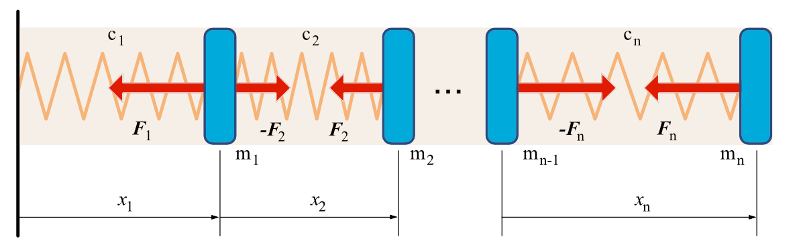

## Стержень, как система материальных точек, связанных пружинами

Представим однородный стержень постоянного сечения $$A$$ массы $$M$$ в виде системы $$n$$ материальных точек, соединенных невесомыми линейно-упругими элементами -- пружинами. Масса материальных точек:

$$
  m_i = M/n
$$

Жесткость пружин:

$$
  c_i = n \cdot \frac{EA}{L}
$$

где $$E$$ -- модуль Юнга, $$L$$ -- длина стержня.

Уравнение движения массы $$i$$ имеет вид (в проекции на горизонтальную ось $$x$$ )

$$
  m_i \sum_{k=1}^{i} \ddot{x}_k = -F_i + F_{i+1}, \quad i = 1, \ldots, n-1
$$

Для последней массы ($$i=n$$)

$$
  m_n \sum_{k=1}^{n} \ddot{x}_k = -F_n
$$

Силы, действующие на массы вычисляются следующим образом

$$
  F_k = c_k (x_k - l_0), \quad k=1,\ldots,n
$$

где $$l_0$$ - свободная длина пружины

$$
  l_0 = \frac{L}{n}
$$  

~~~matlab
% Модуль Юнга Н/м2
E  = 1000000;
% Площадь поперечного сечения стержня м2
A  = 0.001;
% Погонная масса кг/м
mu = 10.0;
% Длина стержня м
L  = 1.0;
% Масса стержня
M   = L*mu;
% Количество материальных точек, на которые разбивается стержень
N   = 30;
% Начальное расстояние между точками (l0)
p.L = L/N;
% Масса материальной точки
p.m = M/N;
% Жесткость пружин
p.c = N*E*A/L;
%
% Начальное положение точек
x0  = (1:N)'/N*(L+0.1);
% Начальная скорость
vx0 = zeros(N,1);
% Вектор состояния
q0  = [x0;vx0];

% Интегрирование
[t, q] = ode113(@(t,q) dqdt(t,q,p),0:0.002:2,q0,odeset('RelTol',1e-8));

% Создаем палитру (каждая строка -- тройка RGB, определяющая цвет)
cmap = jet(192);
% Вектор деформаций пружин
dx = [q(:,1)-p.L (q(:,2:N) - q(:,1:N-1))-p.L];
% Максимальная деформация
dx_max = max(max(dx))+0.001;
% Минимальная деформация
dx_min = min(min(dx))-0.001;
% Функция преобразования деформации в цвет
deformation2color = @(def) floor((def-dx_min)/((dx_max-dx_min)/192));

% Открываем файл для записи видео
v = VideoWriter('rod_d.avi');
open(v);

figure('Position',[100 100 900 600]);
axis([0 L*1.3,-0.5, 0.5]);
grid on;
hold on;

% Для каждого момента времени из таблицы результатов интегрирования
for i=1:size(t,1)
    % Очищаем рисунок
    cla;
    % Для каждой точки стержня
    for j=1:N        
        % Если это первая точка
        if j==1
           % то деформация пружины определяется только
           deformation = q(i,j)-p.L;
           col = deformation2color(deformation);
           patch([0 q(i,j) q(i,j) 0],[0.1 0.1 -0.1 -0.1],cmap(col,:));
        else
           deformation = q(i,j)-q(i,j-1)-p.L;
           col = deformation2color(deformation);           
           patch([q(i,j-1) q(i,j) q(i,j) q(i,j-1)],[0.1 0.1 -0.1 -0.1],cmap(col,:));
        end
    end
    text(0.1,0.45,sprintf('T=%5.3f c. Длина стержня L=%5.3f м',t(i),q(i,N)));   
    dydx = ([q(i,1) diff(q(i,1:N))] - repmat(p.L,1,N));
    plot([0 q(i,1:N)],[0 dydx*N]);
    frame = getframe(gcf);
    writeVideo(v,frame);
end
close(v);
~~~

Файл-функция правых частей дифференциальных уравнений движения системы материальных точек

~~~matlab
function dq = dqdt(t, q, p)

n  = size(q,1)/2;
x  = q(1:n);

% x1 (x2-x1) (x3-x2) (x4-x3) ... (xn - x_n-1)
xdif = [x(1);diff(x)];
% x1-L (x2-x1)-L (x3-x2)-L (x4-x3)-L ... (xn - x_n-1)-L
dx   = xdif - repmat(p.L,n,1);
%
F    = -dx*p.c;
F    = F - [F(2:end); 0];
a    = F/p.m;
dq   = [q(n+1:end);a];

end
~~~

## Стержень, как распределённая система

Упругие свободные колебания стержная как распределенной системы описыватся уравнением в частных производных

$$
  1111
$$

~~~matlab
% Модуль Юнга Н/м2
E  = 1000000;
% Площадь поперечного сечения м2
A  = 0.001;
% Погонная масса kg/м
mu = 10.0;
% Длина стержная м
L  = 1.0;
% Количество учитываемых собственных форм
k  = 1:10;
a  = (2*k-1)*pi*0.5/L;
% Массив частот
p  = a*sqrt(E*A/mu); % рад/с
% Начальная деформация
% К концу стержня приложена растягивающая сила F
F  = 100; % Н
y0 = @(xx) interp1(linspace(0,L,10),F*linspace(0,L,10)/(E*A),xx);
% Постоянные, определяемые по начальным условиям (для частоты i)
M  = @(i)  (2/L)*integral(@(xx) y0(xx).*sin(a(i).*xx),0, L);
M  = @(i)  (2*F/(L*E*A))*sin(a(i)*L)/(a(i)^2.0);
% Начальная скорость деформаций равна нулю, поэтому (для частоты i)
N  = @(i) 0;
% Слагаемые общего решения
yk = @(i,t,x) (M(i)*cos(p(i)*t)+N(i)*sin(p(i)*t))*sin((2*i-1)*pi*x*0.5/L);
% Слагаемые деформации
ek = @(i,t,x) (M(i)*cos(p(i)*t)+N(i)*sin(p(i)*t))*cos((2*i-1)*pi*x*0.5/L)*(2*i-1)*pi*0.5/L;
% Общее решение y(t,x)
y   = @(t,x) sum(arrayfun(@(i) yk(i,t,x),k));
% Деформация
eks = @(t,x) sum(arrayfun(@(i) ek(i,t,x),k));
% ------------------------------------------------------------------------
% Рисуем
% ------------------------------------------------------------------------
% Видео
v = VideoWriter('rod_c.avi');
open(v);

% Разделяем балку на 30 частей (для раскраски)
x = linspace(0,L,30);
figure('Position',[100 100 900 600]);
axis([0 1.3 -0.5 0.5]);
hold on;
% Цветовая палитра JET
cmap = colormap(jet(128));
% Максимальная деформация
maxd =  0.2;
mind = -0.2;
def2index = @(d) floor((d-mind)/((maxd-mind)/size(cmap,1)));
for t=0:0.002:2
    cla;
    yx = arrayfun(@(xx) y(t,xx),x);    
    pos = x + yx;    
    defx = arrayfun(@(xx) eks(t,xx),x);
    if 1 == 2
        plot(x, arrayfun(@(xx) y(t,xx),x));
    else
        for j = 1:size(x,2)
            col = cmap( def2index(defx(j)),:);
            prev_point = 0;
            if j ~= 1
                prev_point = pos(j-1);
            end
            patch([prev_point pos(j) pos(j) prev_point],...
                [0.1 0.1 -0.1 -0.1],col,'EdgeColor','none');            
        end
        plot(pos, arrayfun(@(xx) eks(t,xx),x));
        xlabel('x, м');ylabel('y, м');box('on');
    end
    %plot([0 L L 0],[0.103 0.103 -0.101 -0.101],'k:');
    text(0.1,0.45,sprintf('T=%5.3f c. Длина стержня L=%5.3f м',t,yx(end)+L));    
    text(0.1,0.35,sprintf('Частоты (Гц): '));    
    text(0.1,0.31,sprintf('%3.1f | ',(2*pi./p).^-1));    
    frame = getframe;    
    writeVideo(v,frame);
end
close(v);
~~~
