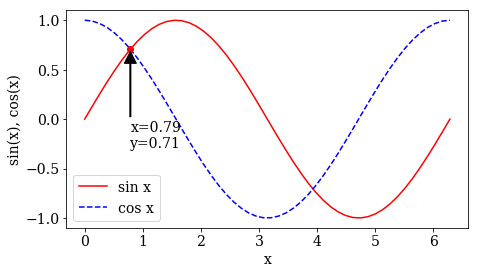

## Задание 1

Построить график функций  $$\cos x$$, $$\sin x$$  на интервале от 0 до  $$2\pi$$ на одном рисунке, обозначив  первую точку пересечения двух графиков окружностью с центром в точке пересечения и выносной линией от этой окружности с указанием значения $$x$$ для точки пересечения и значения функции в этой точке.

## Задание 2

Задать размер графика 18 x 10 см, размер шрифта 14, семейство шрифтов Times.   

## Задание 3

Сохранить изображение графика в формате png.

