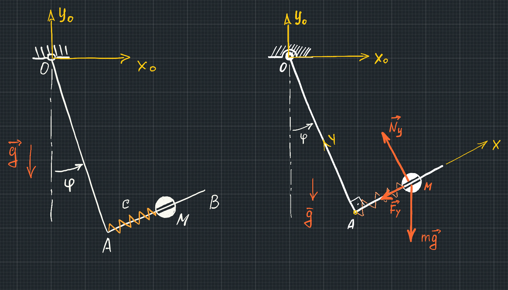

Рассмотрим движение плоского механизма, представленного на рисунке 1. Механизм состоит из тела 1, представляющего собой два жестко соединенных в точке В стержня. В точке О тело 1 шарнирно закреплено на неподвижной опоре. Вдоль стержня АВ может двигаться шарик M (тело 2), который представлен материальной точкой с известной массой $$ m $$. К шарику прикреплена пружина, другой конец которой закреплен в точке А тела 1. Механизм движется в вертикальной плоскости: тело 1 вращается вокруг шарнира О по закону: 

$$
\varphi = \varphi_0 + \omega t
$$ 

Рисунок 1 - Схема механической системы и силы, действующие на шарик
{:.figure}

## Вывод уравнения движения шарика вдоль стержня с использованием уравнений относительного движения

Уравнение относительного движения шарика (по отношению к неинерциальной системе координат $$ Axy $$) в векторной форме имеет вид

$$
    m \vec{a}_r = \vec{F}_y + m \vec g + \vec N_y + \vec{\Phi}^e + \vec{\Phi}^k 
$$

В правой части уравнения к активным силам (сила действия пружины и сила притяжения), силе реакции опоры (сила действия стержня АВ на шарик) добавлены переносная сила инерции $$ \Phi^e $$, учитывающая вращение подвижной системы координат вокруг шарнира О и сила инерции Кориолиса $$ \Phi^k $$.   

### Активные силы и сила реакции

Ifhbr 

### Силы инерции

Переносная сила инерции $$ \Phi^e $$ при вращении тела 1 с постоянной угловой скоростью определяется выражением

$$
    \Phi^e = \omega^2 \, OM \, m 
$$

Сила инерции Кориолиса направлена перпендикулярно стержню АВ и определяется выражением

$$
    \Phi^k = 2 m \dot x \omega 
$$

## Вывод уравнения движения шарика вдоль стержня с использованием уравнений абсолютного движения

### Координатный столбец радиус вектора шарика в неподвижной системе координат

Запишем положение шарика в неподвижной системе координат $$ Ox_0y_0 $$, начало которой находится в шарнире О. Координатный столбец радиус-вектора шарика в неподвижной системе координат выражен через его положение по отношению к подвижной системе координат $$ Axy $$ (координата $$ x $$) и угловое положение  подвижной системы координат по отношению к неподвижной (угол $$ \varphi $$):

$$
    r = \{ OA \, \text{Sin}[\varphi[t]]\ + x[t] \, \text{Cos}[\varphi[t]], -OA \, \text{Cos}[\varphi[t]]\ + x[t] \, \text{Sin}[\varphi[t]] \}
$$

### Координатный столбец абсолютного ускорения шарика 

Для определения абсолютного ускорения шарика используем функцию дифференцирования

$$
    a = \text{D}[r,\{t,2\}]
$$

###  Силы действующие на шарик

Шарик движется под действием силы веса $$mg$$, силы пружины $$F_y$$ силы реакции стержня АВ $$N_y$$. Запишем проекции этих сил на оси неподвижной системы координат

$$
    F = \{0,-m\,g\} - k\,(x[t]-l_0)\{\text{Cos}[\varphi[t]],\,\text{Sin}[\varphi[t]]\} + Ny\,\{-\text{Sin}[\varphi[t]],\text{Cos}[\varphi[t]]\}
$$

### Уравнение движения

Спроецируем векторное уравнение $$m \vec a = \vec F$$ на подвижную ось $Ax$, единичный вектор которой в неподвижной системе координат определяется выражением

$$
    e_x = \{ \text{Cos}[\varphi[t]],\, \text{Sin}[\varphi[t]]\}
$$

Для вычисления скалярного произведения вектора абсолютного ускорения шарика и единичного вектора $$e_x$$ используется оператор "точка": 

$$
    \text{eqx} = m\,a.e_x = F.e_x //\text{FullSimplify}
$$

Также можно спроецировать уравнение движения на ось $$Ay$$

$$
    \text{eqy} = m\,a.e_y = F.e_y //\text{FullSimplify}
$$

